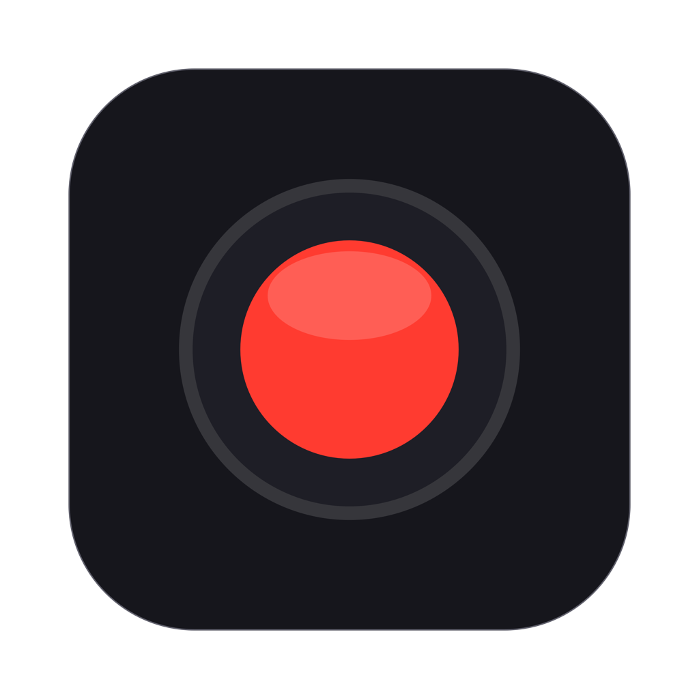

<p align="center">
  
</p>

<h1 align="center">AudioMac</h1>

<p align="center">
  Registra lo schermo del Mac <b>con l'audio interno</b> e il microfono.<br>
  Quello che ⌘⇧5 non sa fare.
</p>

<p align="center">
  
  
  
  
</p>

---

## Perché

Lo strumento di registrazione integrato in macOS (⌘⇧5, QuickTime) registra lo schermo con il **microfono**, ma
non con l'audio che il Mac sta riproducendo: video, call, musica, giochi. Per farlo di solito serve installare un
driver audio virtuale e configurare a mano un dispositivo multi-uscita.

AudioMac lo fa da solo, con un'app minimale:

- 🖥️ **Schermo intero o singola finestra**
- 🔊 **Audio del Mac** e 🎙️ **microfono**, su due tracce separate nello stesso file
- 🔇 **Muto in tempo reale** per ciascuna sorgente, anche durante la registrazione, senza perdere la sincronia
- 📊 **Livelli audio** di entrambi gli ingressi sempre visibili, anche prima di registrare
- 🎞️ **H.264 o HEVC**, 30 o 60 fps, file `.mov` salvati in `~/Movies`
- ⌨️ **⇧⌘R** per avviare/fermare

## Compatibilità

AudioMac funziona da **macOS 11 Big Sur** in poi e sceglie da sola la tecnica migliore per il sistema su cui gira:

| macOS | Video | Audio del Mac | Microfono |
|---|---|---|---|
| **13 Ventura e successivi** | ScreenCaptureKit | ScreenCaptureKit, nessun driver | AVFoundation |
| **12.3 – 12.x Monterey** | ScreenCaptureKit | driver AudioMac Loopback | AVFoundation |
| **11 Big Sur – 12.2** | CGDisplayStream / istantanee della finestra | driver AudioMac Loopback | AVFoundation |

Da macOS 13 non serve installare nulla. Prima, macOS non offre alcuna API per catturare l'audio di sistema: per
questo AudioMac include un piccolo driver audio virtuale.

## Installazione

1. Compila l'app (vedi sotto) oppure scarica una build.
2. Apri **AudioMac** e concedi i permessi richiesti in *Impostazioni di Sistema → Privacy e sicurezza*:
   - **Registrazione schermo** (su macOS 15: *Registrazione schermo e audio di sistema*)
   - **Microfono**
3. Riapri l'app dopo aver concesso il permesso di registrazione schermo.

> L'app è firmata ad-hoc: al primo avvio usa clic destro → **Apri**. Dopo ogni ricompilazione macOS potrebbe
> chiedere di nuovo il permesso di registrazione schermo.

### Su macOS 11 e 12: il driver AudioMac Loopback

Nella sezione *Audio* compare il pulsante **Installa driver audio…**, che copia il driver in
`/Library/Audio/Plug-Ins/HAL` (serve la password di amministratore) e riavvia il servizio audio.

Mentre AudioMac è aperta, l'uscita audio passa da un dispositivo multi-uscita
**"AudioMac (altoparlanti + registrazione)"**: continui a sentire tutto normalmente e il driver riceve una copia
dell'audio da registrare. Alla chiusura dell'app l'uscita torna quella di prima. Durante questo periodo i tasti del
volume non sono disponibili: è un limite dei dispositivi multi-uscita di macOS.

Il driver si rimuove dal pulsante **Disinstalla driver** nell'app, oppure a mano:

```bash
sudo rm -rf /Library/Audio/Plug-Ins/HAL/AudioMacLoopback.driver && sudo killall coreaudiod
```

## Compilazione

Serve Xcode (testato con Xcode 26). La build è universale (Intel + Apple Silicon) con target minimo macOS 11.

```bash
./build.sh
```

L'app viene creata in `build/Release/AudioMac.app`. In alternativa apri `AudioMac.xcodeproj` e premi ⌘R.

Per provare su un Mac recente il percorso usato da Big Sur/Monterey (driver + API video precedenti):

```bash
defaults write com.rikdev.audiomac ForceLegacyCapture -bool YES   # attiva
defaults delete com.rikdev.audiomac ForceLegacyCapture            # torna al normale
```

## Come funziona

```
            ┌────────────── Video ──────────────┐
 schermo ──►│ ScreenCaptureKit / CGDisplayStream │──┐
            └────────────────────────────────────┘  │     ┌──────────────┐
            ┌─────────── Audio del Mac ──────────┐  ├────►│ AVAssetWriter│──► .mov
 sistema ──►│ ScreenCaptureKit / driver loopback │──┤     │ 1 video      │    (H.264/HEVC,
            └────────────────────────────────────┘  │     │ 2 audio AAC  │     2 tracce AAC)
            ┌──────────── Microfono ─────────────┐  │     └──────────────┘
 micro ────►│ AVCaptureSession                   │──┘
            └────────────────────────────────────┘
```

- Tutte le sorgenti consegnano i campioni su un'unica coda, con timestamp nel clock host, così video e tracce
  audio restano sincronizzati.
- Il **muto** sostituisce i campioni con silenzio invece di interrompere la traccia; anche i buchi dello stream
  audio (es. nessun suono in riproduzione) vengono riempiti con silenzio.
- In modalità *singola finestra* l'audio registrato è comunque quello di **tutto il Mac** (ScreenCaptureKit, di
  suo, catturerebbe solo l'app proprietaria della finestra).
- La finestra di AudioMac viene esclusa dal video nella modalità *schermo intero* (da macOS 12.3).

## Struttura del progetto

```
AudioMac/                 App (SwiftUI, macOS 11+)
├── AudioMacApp.swift     Entry point, comandi, chiusura ordinata
├── ContentView.swift     Interfaccia: sorgente video, canali audio con meter e muto
├── Recorder.swift        Stato dell'app e scelta della tecnica in base alla versione di macOS
├── CaptureEngine.swift   Scrittura del file, livelli, muto, riempimento dei silenzi
├── VideoSources.swift    ScreenCaptureKit, CGDisplayStream, istantanee finestra
├── AudioSources.swift    Audio di sistema (ScreenCaptureKit / loopback) e microfono
├── LoopbackDriver.swift  Installazione del driver e instradamento multi-uscita
└── SourceCatalog.swift   Elenco di schermi e finestre
AudioMacDriver/           Driver AudioServerPlugIn "AudioMac Loopback" (C)
icon/                     Sorgente Affinity ed esportazioni dell'icona (l'app usa AudioMac/Assets.xcassets)
```

## Limiti noti

- Su macOS 11–12.2 in modalità *schermo intero* la finestra di AudioMac compare nel video, e la modalità
  *singola finestra* usa istantanee periodiche (più CPU).
- Il driver supporta 44,1 e 48 kHz: se l'uscita audio del Mac lavora a una frequenza diversa, il dispositivo
  multi-uscita potrebbe non funzionare.
- Audio del Mac e microfono sono su due tracce separate: QuickTime e i programmi di montaggio le leggono entrambe.

## Licenza

Pubblico dominio ([The Unlicense](LICENSE)): puoi usare, copiare, modificare, distribuire e vendere AudioMac,
anche in progetti commerciali e chiusi, senza chiedere permesso e senza obbligo di citare la fonte.
